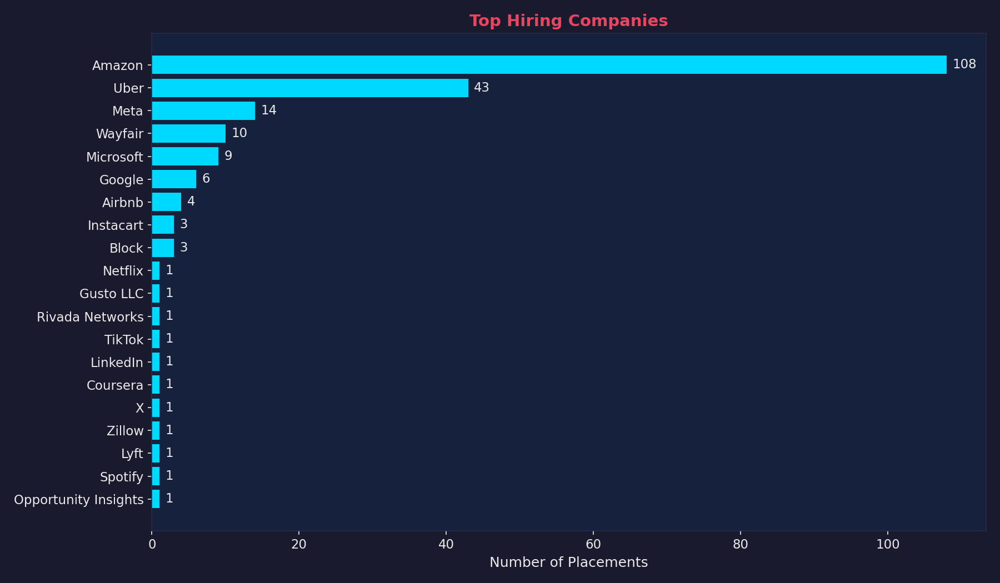
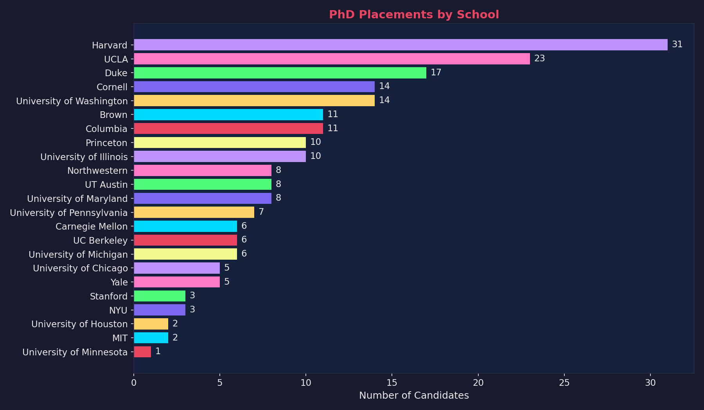
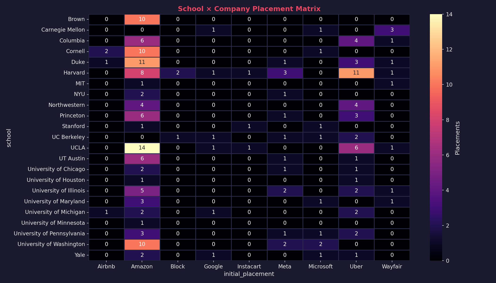
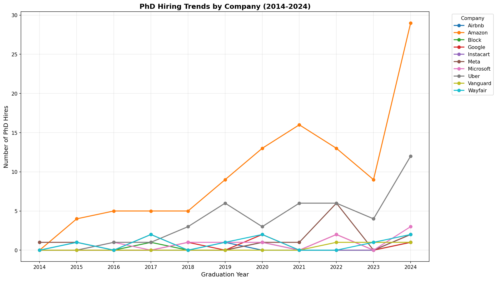
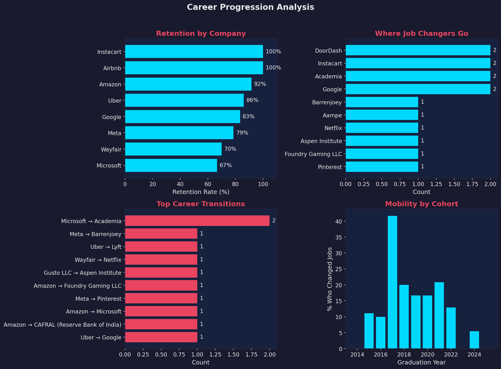

# Econ PhD Tech Tracker

Where do Economics PhDs land in tech? This project scrapes placement data from 24 top economics PhD programs to understand which tech companies hire PhD economists.

## Key Findings

### Top Companies Hiring Econ PhDs


### Placements by School


### School × Company Heatmap


### Hiring Trends Over Time


### Career Progression


## Data

Tracking **24 top economics PhD programs**: Berkeley, Brown, CMU, Columbia, Cornell, Duke, Harvard, Illinois, Maryland, Michigan, Minnesota, MIT, Northwestern, NYU, Penn, Princeton, Stanford, UChicago, UCLA, UT Austin, Virginia, Washington, Wisconsin, Yale

**100+ tech companies** including:
- **FAANG+:** Google, Meta, Amazon, Apple, Microsoft, Netflix
- **Unicorns:** Uber, Airbnb, Stripe, DoorDash, Instacart
- **AI/ML:** OpenAI, Anthropic, DeepMind, Scale AI
- **Fintech:** Two Sigma, Jane Street, Citadel, Capital One

## Quick Start

```bash
pip install -r requirements.txt
python scraper.py    # Scrape placement data
python scoring.py    # Generate statistics
python charts.py     # Generate visualizations
```

## Pipeline

1. **Scrape** - Pull placement data from university websites
2. **Enrich** - Add LinkedIn/Scholar data via Perplexity API (optional)
3. **Score** - Generate company hiring statistics
4. **Visualize** - Generate charts

## License

MIT
